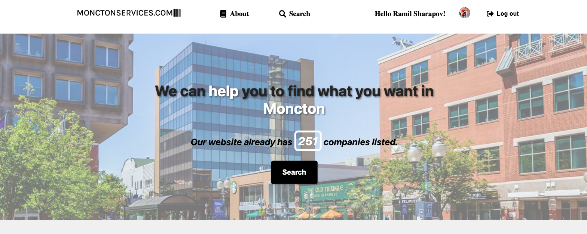
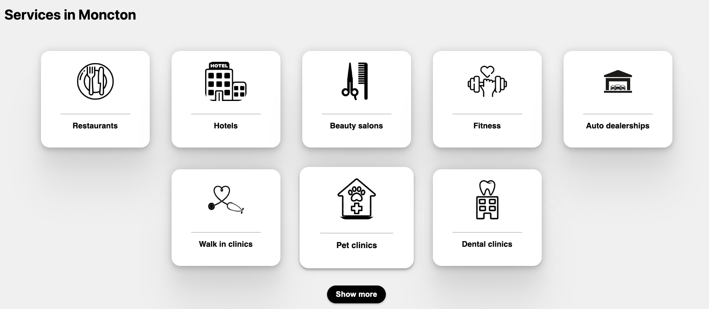
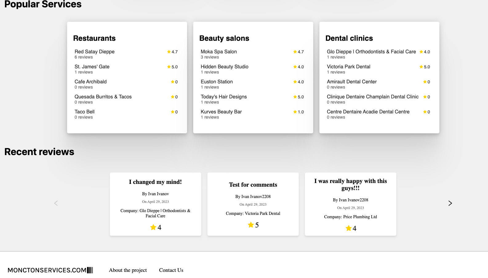
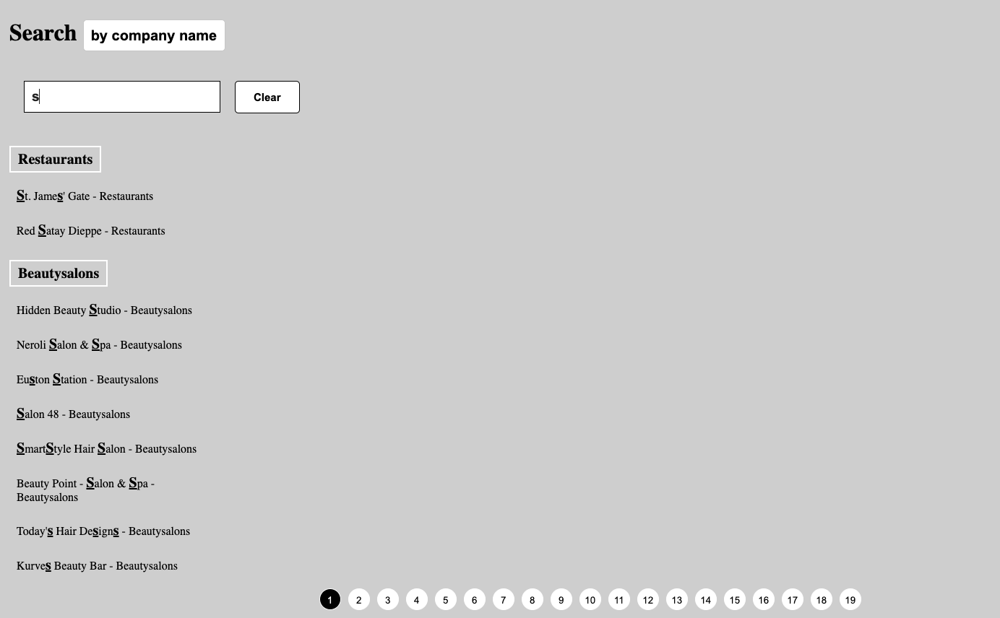
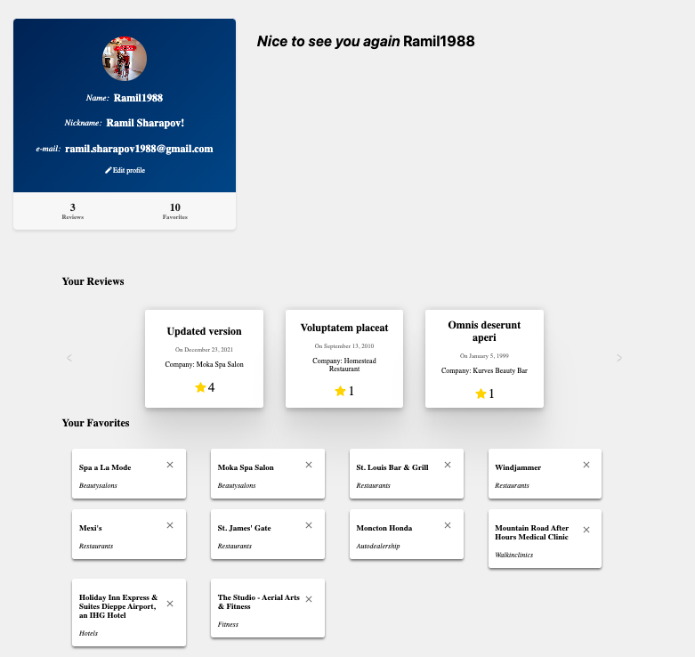
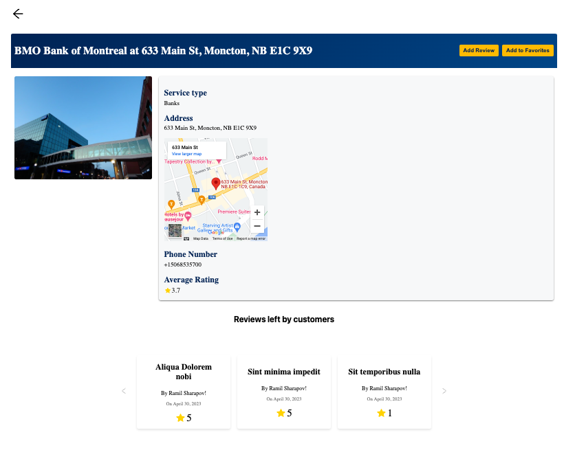
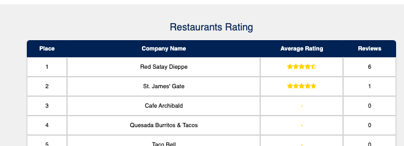

# Monctonservices Web Application

This project is a responsive web application designed to help users find various services in the Moncton area. It provides a user-friendly interface to search for companies and view their ratings, recent reviews, and popular services. With its responsive design, users can access the application seamlessly across different devices.

## Features

- Search for companies offering various services in Moncton
- View a list of all services and filter them by category
- Explore popular services in the area
- Read recent reviews for various companies
- User profile page that allows to see left reviews and bookmarks of companies added
- Company page: allows users to view detailed information about different companies, add and view reviews, and manage their favorite companies
- Companies rating table that allows users to view and compare company ratings based on different service types
- Responsive design for optimal viewing on mobile devices

## Technologies

The project is built using the following technologies:

- React.js for front-end development
- Styled-components for CSS styling
- React Router for navigation
- Node.js and Express for back-end API
- MongoDB for database storage

## Images from the projects:

 

- ### Main page (top)

 

- ### Service types (main page continue)

 

- ### Popular services, Recent Reviews, Footer (main page continue)

 

- ### Search engine

 

- ### Profile page

 

- ### Company page

 

- ### Rating table

 

### Thank you for watching!
